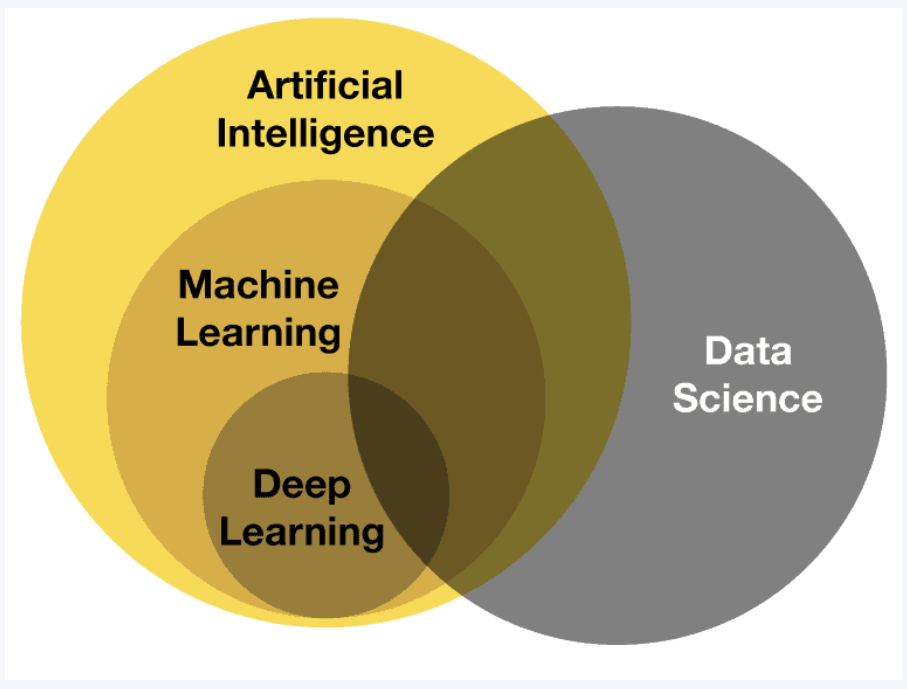
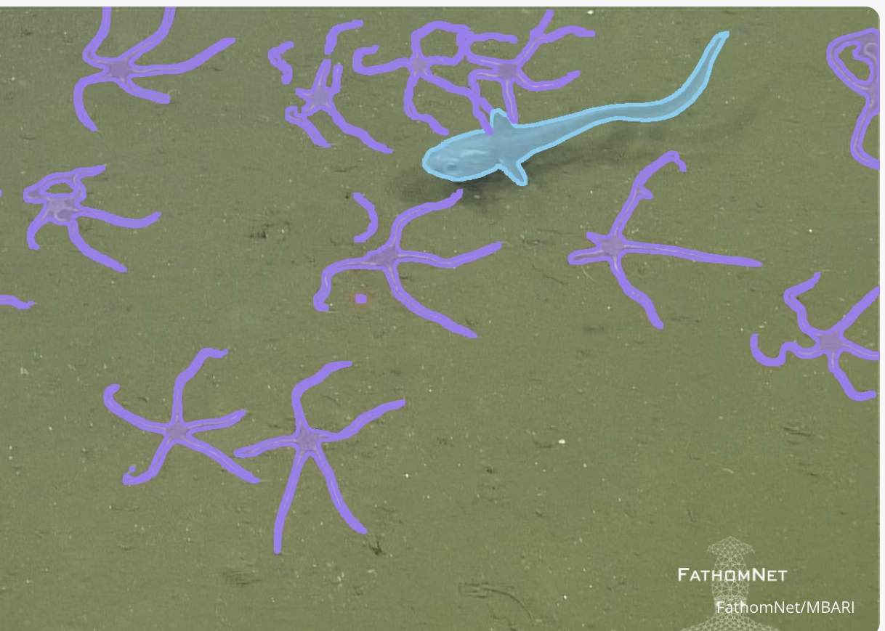

# M2PI-mini-project

Maybe you asked yourself:

**`“What exactly are Computer Vision and FathomNet? And what are we trying to do in this project?”`**

That is actually a very good question.

Before we jump into Computer Vision and deep learning models like **YOLO**, we first need to understand the dataset we are going to work with throughout this workshop.

The dataset we will use is called [FathomNet]([(https://www.fathomnet.org/news/open-data-opens-new-opportunities)](https://www.fathomnet.org/news/open-data-opens-new-opportunities)).
FathomNet is a large underwater image database designed to help researchers, scientists, and machine learning engineers study ocean life using artificial intelligence.

The dataset contains:

- underwater images
- marine creatures
- annotations and labels
- bounding boxes for object detection tasks

So the main goal of this project is to teach a computer how to “see” and recognize objects inside underwater images.

*What is Computer Vision?*

Computer Vision is a field of Artificial Intelligence (AI) that enables computers to understand and analyze visual information such as:

- images
- videos
- camera streams

In other words, Computer Vision tries to simulate part of human vision.

Humans can naturally look at an image and recognize:

- fish
- coral
- sharks
- rocks
- underwater plants

But for a computer, an image is only a large matrix of numbers representing pixel values.

The challenge is:

How can we teach a machine to understand those numerical patterns and recognize meaningful objects?

This is where Machine Learning and Deep Learning become important.

What Are We Going to Do?

In this project, we will use a deep learning object detection model called:

YOLO (You Only Look Once)

YOLO is a Computer Vision model that can:

- detect objects
- locate them in the image
- classify them simultaneously

For example, instead of simply saying:

“There is a fish in this image”

YOLO can say:

“There is a fish located here, with these coordinates, and I am 95% confident about it.”

So throughout this workshop, we will learn how to:

- work with underwater datasets
- understand object detection
- train a YOLO model
- evaluate predictions
- connect the mathematics behind deep learning to real applications

And most importantly, we will see how concepts from:

- linear algebra
- calculus
- optimization
- probability
- geometry

all appear naturally inside modern AI systems.

